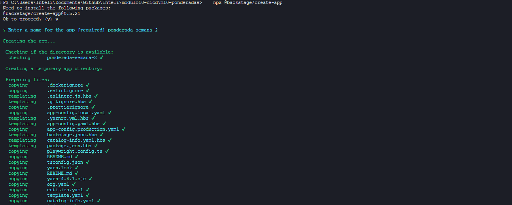
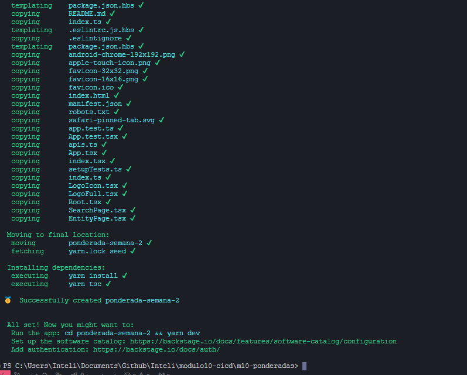
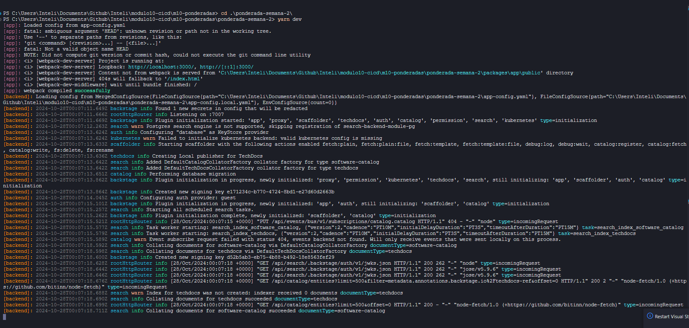
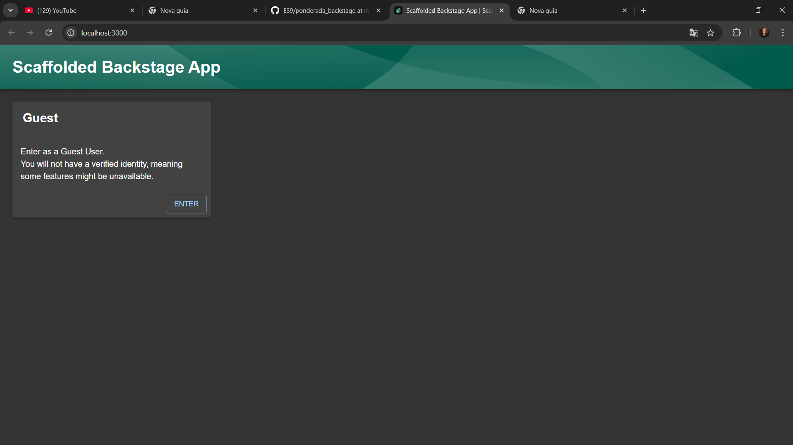
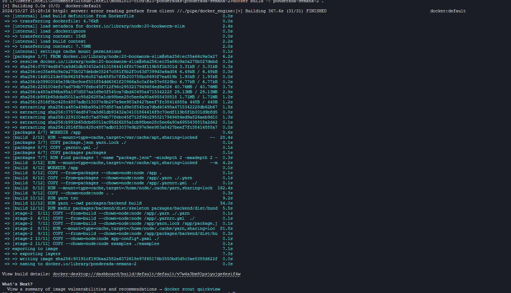

# Ponderada Semana 2 - Gestão de Configuração
Rafael Mateus Zimmer Techio

## Configuração de aplicação backstage

O primeiro passo para a configuração da ferramenta de Backstage é a instalação via node.js:

```
npx @backstage/create-app 
```




Após a instalação da ferramenta, uma série de recursos serão instalados e configurados. É possível iniciar a aplicação pelo yarn:

```
yarn dev
```



E a aplicação será iniciada:




## Mudança para SQLite

### app.config:

Altere o arquivo para o seguinte código:

```
app:
  title: Scaffolded Backstage App
  baseUrl: http://localhost:3000

organization:
  name: My Company

backend:
  # Used for enabling authentication, secret is shared by all backend plugins
  # See https://backstage.io/docs/auth/service-to-service-auth for
  # information on the format
  # auth:
  #   keys:
  #     - secret: ${BACKEND_SECRET}
  baseUrl: http://localhost:7007
  listen:
    port: 7007
    # Uncomment the following host directive to bind to specific interfaces
    # host: 127.0.0.1
  csp:
    connect-src: ["'self'", 'http:', 'https:']
    # Content-Security-Policy directives follow the Helmet format: https://helmetjs.github.io/#reference
    # Default Helmet Content-Security-Policy values can be removed by setting the key to false
  cors:
    origin: http://localhost:3000
    methods: [GET, HEAD, PATCH, POST, PUT, DELETE]
    credentials: true
  # This is for local development only, it is not recommended to use this in production
  # The production database configuration is stored in app-config.production.yaml
  database:
    client: sqlite3
    connection:
      filename: ':memory:'
  # workingDirectory: /tmp # Use this to configure a working directory for the scaffolder, defaults to the OS temp-dir

integrations:
  github:
    - host: github.com
      # This is a Personal Access Token or PAT from GitHub. You can find out how to generate this token, and more information
      # about setting up the GitHub integration here: https://backstage.io/docs/integrations/github/locations#configuration
      token: ${GITHUB_TOKEN}
    ### Example for how to add your GitHub Enterprise instance using the API:
    # - host: ghe.example.net
    #   apiBaseUrl: https://ghe.example.net/api/v3
    #   token: ${GHE_TOKEN}

proxy:
  ### Example for how to add a proxy endpoint for the frontend.
  ### A typical reason to do this is to handle HTTPS and CORS for internal services.
  # endpoints:
  #   '/test':
  #     target: 'https://example.com'
  #     changeOrigin: true

# Reference documentation http://backstage.io/docs/features/techdocs/configuration
# Note: After experimenting with basic setup, use CI/CD to generate docs
# and an external cloud storage when deploying TechDocs for production use-case.
# https://backstage.io/docs/features/techdocs/how-to-guides#how-to-migrate-from-techdocs-basic-to-recommended-deployment-approach
techdocs:
  builder: 'local' # Alternatives - 'external'
  generator:
    runIn: 'docker' # Alternatives - 'local'
  publisher:
    type: 'local' # Alternatives - 'googleGcs' or 'awsS3'. Read documentation for using alternatives.

auth:
  # see https://backstage.io/docs/auth/ to learn about auth providers
  providers:
    # See https://backstage.io/docs/auth/guest/provider
    guest: {}

scaffolder:
  # see https://backstage.io/docs/features/software-templates/configuration for software template options

catalog:
  import:
    entityFilename: catalog-info.yaml
    pullRequestBranchName: backstage-integration
  rules:
    - allow: [Component, System, API, Resource, Location]
  locations:
    # Local example data, file locations are relative to the backend process, typically `packages/backend`
    - type: file
      target: ../../examples/entities.yaml

    # Local example template
    - type: file
      target: ../../examples/template/template.yaml
      rules:
        - allow: [Template]

    # Local example organizational data
    - type: file
      target: ../../examples/org.yaml
      rules:
        - allow: [User, Group]

    ## Uncomment these lines to add more example data
    # - type: url
    #   target: https://github.com/backstage/backstage/blob/master/packages/catalog-model/examples/all.yaml

    ## Uncomment these lines to add an example org
    # - type: url
    #   target: https://github.com/backstage/backstage/blob/master/packages/catalog-model/examples/acme-corp.yaml
    #   rules:
    #     - allow: [User, Group]

kubernetes:
  # see https://backstage.io/docs/features/kubernetes/configuration for kubernetes configuration options

# see https://backstage.io/docs/permissions/getting-started for more on the permission framework
permission:
  # setting this to `false` will disable permissions
  enabled: true
```

### app-config.production.yaml:

Altere o arquivo para o seguinte código:

```
app:
  # Should be the same as backend.baseUrl when using the `app-backend` plugin.
  baseUrl: http://localhost:7007

backend:
  # Note that the baseUrl should be the URL that the browser and other clients
  # should use when communicating with the backend, i.e. it needs to be
  # reachable not just from within the backend host, but from all of your
  # callers. When its value is "http://localhost:7007", it's strictly private
  # and can't be reached by others.
  baseUrl: http://localhost:7007
  # The listener can also be expressed as a single <host>:<port> string. In this case we bind to
  # all interfaces, the most permissive setting. The right value depends on your specific deployment.
  listen: ':7007'

  # config options: https://node-postgres.com/apis/client
  database:
    client: sqlite3
    connection:
      filename: ':memory:'
      # https://node-postgres.com/features/ssl
      # you can set the sslmode configuration option via the `PGSSLMODE` environment variable
      # see https://www.postgresql.org/docs/current/libpq-ssl.html Table 33.1. SSL Mode Descriptions (e.g. require)
      # ssl:
      #   ca: # if you have a CA file and want to verify it you can uncomment this section
      #     $file: <file-path>/ca/server.crt

auth:
  providers:
    guest: {}

catalog:
  # Overrides the default list locations from app-config.yaml as these contain example data.
  # See https://backstage.io/docs/features/software-catalog/#adding-components-to-the-catalog for more details
  # on how to get entities into the catalog.
  locations:
    # Local example data, replace this with your production config, these are intended for demo use only.
    # File locations are relative to the backend process, typically in a deployed context, such as in a Docker container, this will be the root
    - type: file
      target: ./examples/entities.yaml

    # Local example template
    - type: file
      target: ./examples/template/template.yaml
      rules:
        - allow: [Template]

    # Local example organizational data
    - type: file
      target: ./examples/org.yaml
      rules:
        - allow: [User, Group]

```


### Dockerfile

Crie um dockerfile com a seguinte configuração:

```
# Stage 1 - Create yarn install skeleton layer
FROM node:20-bookworm-slim AS packages

WORKDIR /app
COPY package.json yarn.lock ./
COPY .yarn ./.yarn
COPY .yarnrc.yml ./

COPY packages packages

# Comment this out if you don't have any internal plugins
# COPY plugins plugins

RUN find packages \! -name "package.json" -mindepth 2 -maxdepth 2 -exec rm -rf {} \+

# Stage 2 - Install dependencies and build packages
FROM node:20-bookworm-slim AS build

# Set Python interpreter for `node-gyp` to use
ENV PYTHON=/usr/bin/python3

# Install isolate-vm dependencies, these are needed by the @backstage/plugin-scaffolder-backend.
RUN --mount=type=cache,target=/var/cache/apt,sharing=locked \
    --mount=type=cache,target=/var/lib/apt,sharing=locked \
    apt-get update && \
    apt-get install -y --no-install-recommends python3 g++ build-essential && \
    rm -rf /var/lib/apt/lists/*

# Install sqlite3 dependencies. You can skip this if you don't use sqlite3 in the image,
# in which case you should also move better-sqlite3 to "devDependencies" in package.json.
RUN --mount=type=cache,target=/var/cache/apt,sharing=locked \
    --mount=type=cache,target=/var/lib/apt,sharing=locked \
    apt-get update && \
    apt-get install -y --no-install-recommends libsqlite3-dev && \
    rm -rf /var/lib/apt/lists/*

USER node
WORKDIR /app

COPY --from=packages --chown=node:node /app .
COPY --from=packages --chown=node:node /app/.yarn ./.yarn
COPY --from=packages --chown=node:node /app/.yarnrc.yml  ./

RUN --mount=type=cache,target=/home/node/.cache/yarn,sharing=locked,uid=1000,gid=1000 \
    yarn install --immutable

COPY --chown=node:node . .

RUN yarn tsc
RUN yarn --cwd packages/backend build

RUN mkdir packages/backend/dist/skeleton packages/backend/dist/bundle \
    && tar xzf packages/backend/dist/skeleton.tar.gz -C packages/backend/dist/skeleton \
    && tar xzf packages/backend/dist/bundle.tar.gz -C packages/backend/dist/bundle

# Stage 3 - Build the actual backend image and install production dependencies
FROM node:20-bookworm-slim

# Set Python interpreter for `node-gyp` to use
ENV PYTHON=/usr/bin/python3

# Install isolate-vm dependencies, these are needed by the @backstage/plugin-scaffolder-backend.
RUN --mount=type=cache,target=/var/cache/apt,sharing=locked \
    --mount=type=cache,target=/var/lib/apt,sharing=locked \
    apt-get update && \
    apt-get install -y --no-install-recommends python3 g++ build-essential && \
    rm -rf /var/lib/apt/lists/*

# Install sqlite3 dependencies. You can skip this if you don't use sqlite3 in the image,
# in which case you should also move better-sqlite3 to "devDependencies" in package.json.
RUN --mount=type=cache,target=/var/cache/apt,sharing=locked \
    --mount=type=cache,target=/var/lib/apt,sharing=locked \
    apt-get update && \
    apt-get install -y --no-install-recommends libsqlite3-dev && \
    rm -rf /var/lib/apt/lists/*

# From here on we use the least-privileged `node` user to run the backend.
USER node

# This should create the app dir as `node`.
# If it is instead created as `root` then the `tar` command below will
# fail: `can't create directory 'packages/': Permission denied`.
# If this occurs, then ensure BuildKit is enabled (`DOCKER_BUILDKIT=1`)
# so the app dir is correctly created as `node`.
WORKDIR /app

# Copy the install dependencies from the build stage and context
COPY --from=build --chown=node:node /app/.yarn ./.yarn
COPY --from=build --chown=node:node /app/.yarnrc.yml  ./
COPY --from=build --chown=node:node /app/yarn.lock /app/package.json /app/packages/backend/dist/skeleton/ ./
# Note: The skeleton bundle only includes package.json files -- if your app has
# plugins that define a `bin` export, the bin files need to be copied as well to
# be linked in node_modules/.bin during yarn install.

RUN --mount=type=cache,target=/home/node/.cache/yarn,sharing=locked,uid=1000,gid=1000 \
    yarn workspaces focus --all --production && rm -rf "$(yarn cache clean)"

# Copy the built packages from the build stage
COPY --from=build --chown=node:node /app/packages/backend/dist/bundle/ ./

# Copy any other files that we need at runtime
COPY --chown=node:node app-config*.yaml ./

# This will include the examples, if you don't need these simply remove this line
COPY --chown=node:node examples ./examples

# This switches many Node.js dependencies to production mode.
ENV NODE_ENV=production

# This disables node snapshot for Node 20 to work with the Scaffolder
ENV NODE_OPTIONS="--no-node-snapshot"

CMD ["node", "packages/backend", "--config", "app-config.yaml", "--config", "app-config.production.yaml"]
```

### Dockerizando 

Primeiro, crie a imagem docker com o seguinte comando:

```
docker build -t ponderada-semana-2 .
```



e por fim, crie e rode o container docker:

```
docker run -it -p 7007:7007 ponderada-semana-2
```


Dessa forma, é possível utilizar uma aplicação backstage e alterar suas configurações, além de executá-la como docker
